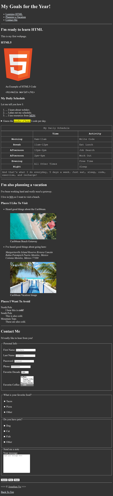
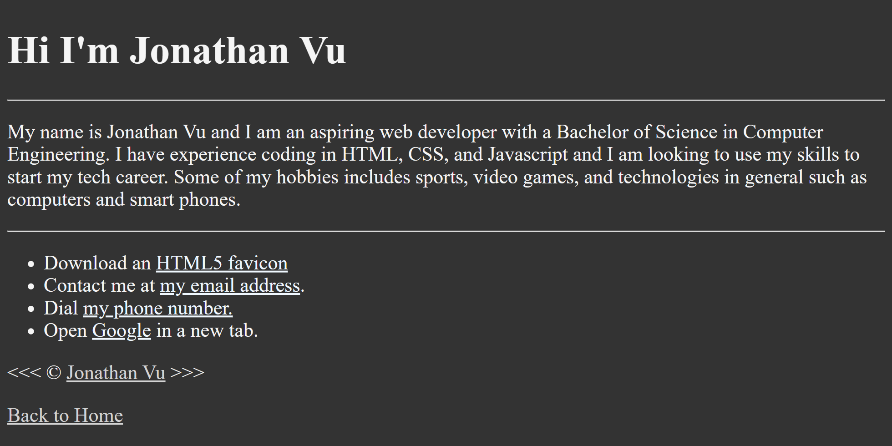
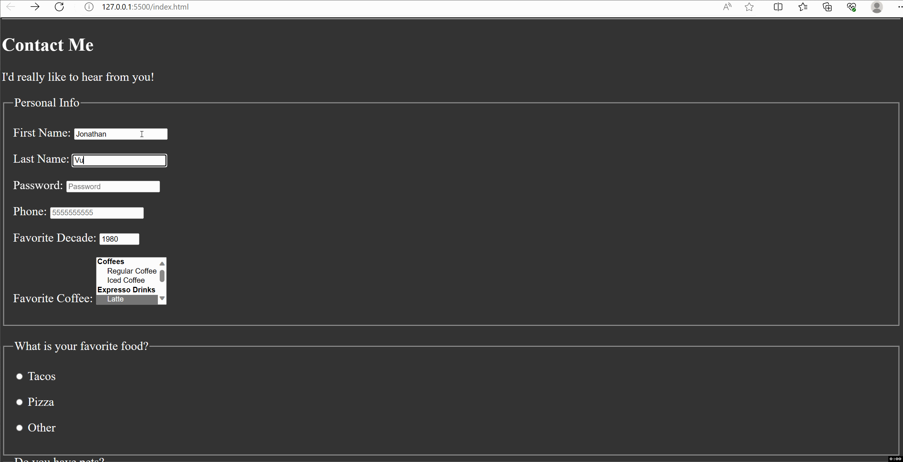

# About Me HTML Website

My first coded project using HTML. Users can see my daily schedule on a custom table, view my favorite and least favorite vacation spots through unordered lists, and input their contact information. Users can also choose from multiple options to select their favorite food, pets, and if you want to post a message on the website.

Clicking on the name at the bottom of the webpage will bring the user to a more detailed description of who I am. Users can click on various links that will perform different actions such as download the HTML5 favicon, contact me via email, call me via phone, and open the Google search engine on a separate tab. 

This website is purely coded using HTML, so users will be able to view the page and navigate without trouble. 

## Core Technical Concepts

This website exists to experience what it is like to code a working website that can also give some facts about myself while having the user input feedback.

The main technical concepts that this website revolves around are the custom table that highlights my daily schedule and the choices the user can input a variety of commands. 

Using the tables property and by manipulating the table head (th tag <th>) and table row (tr tag <tr>), I was able to produce a custom table with each row and column having varying spans and information stored in each data cell (<td>). 

For the inputs, the information inputted by the user gets send to https://httpbin.org/get through the get method. Through labels and inputs, I was able to display a form section where the user can enter their contact information and have it saved on the website. Each input section was separated by its own fieldset.

## Getting Started/Requirements

To run this website, download the code from [github.com/JCV2022/About-Me-Website](https://github.com/JCV2022/About-Me-Website)

A code editor program is needed. Any should do fine, I used Visual Studio Code to code my website.

If you do use Visual Studio Code as your code editor, install the extension Live Server to be able to run the code in real-time.

## Contact Info

My email address is vujonathan00@gmail.com

My github is [github.com/JCV2022](https://github.com/JCV2022/About-Me-Website)

My linkedIn is [linkedin.com/in/jonathan-vu-409a71132/](https://github.com/JCV2022/About-Me-Website)
